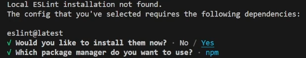

# Explorando Comandos do NPM

Até agora utilizamos os comandos `npm init` e `npm init @eslint/config@0.4.6` do NPM. Vamos entender um pouco melhor como esses comandos funcionam?

## npm init

Como você conferiu, ao executar apenas `npm init`, o terminal se torna interativo e um arquivo `package.json` é criado na pasta atual, de acordo com as respostas do terminal.

Outra forma de usar esse comando é executando `npm init --yes` ou `npm init -y` para pular todas as perguntas do terminal e criar o package.json imediatamente.

### `npm init <inicializador>`

Já o comando abaixo funciona um pouco diferente:

```
npm init @eslint/config@0.4.6
```

Ele é o equivalente a escrever o seguinte:

```
npx @eslint/create-config@0.4.6
```

Com a presença do `npx`, conferimos que na verdade esse comando **executa** o pacote `@eslint/create-config` na versão `0.4.6`.

Note que essa sintaxe “adiciona” o termo `create-` ao parâmetro que escrevemos no comando. É um detalhe interessante de se ter em mente, pois assim podemos procurar corretamente pelo pacote no site do NPM, caso queiramos consultá-lo.

Ou seja, no NPM, o nome do pacote não é `@eslint/config`, e sim `@eslint/create-config`, conforme você pode conferir na [página do site](https://www.npmjs.com/package/@eslint/create-config).

A execução desse pacote torna o terminal interativo e nos faz as perguntas relacionadas à criação do arquivo de configuração do ESLint: o `.eslintrc.json`. Ao final das perguntas, o terminal também pede para instalar o pacote `eslint@latest`.



Recorte de tela do terminal interativo. Ele diz em inglês que nenhuma instalação local do ESLint foi encontrada e que deseja instalar o pacote “eslint@latest”.

Ao responder que sim, a instalação da versão mais recente do `eslint` é feita automaticamente. Mas se tivéssemos respondido que não, poderíamos instalá-lo manualmente no projeto, executando o comando abaixo:

```
npm install eslint@latest
```

### Resumo

Então, note que lidamos com dois pacotes:

- O `@eslint/create-config` é o que executamos para tornar o terminal interativo e criar o arquivo de configurações do ESLint. Esse pacote também foi criado pela equipe do ESLint.
- O `eslint` é o ESLint em si, que deve ser baixado no nosso projeto, a fim de encontrar os erros no código.

Por fim, talvez o pacote `@eslint/create-config` tenha chamado a sua atenção por sua sintaxe diferenciada, com os caracteres arroba `(@) e barra (/)`. Essa sintaxe é um recurso do NPM chamado de scoped packages

### [Voltar ao Menu - Node.js e terminal: dominando o ambiente de desenvolvimento front-end](../menu.md)