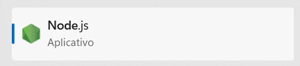
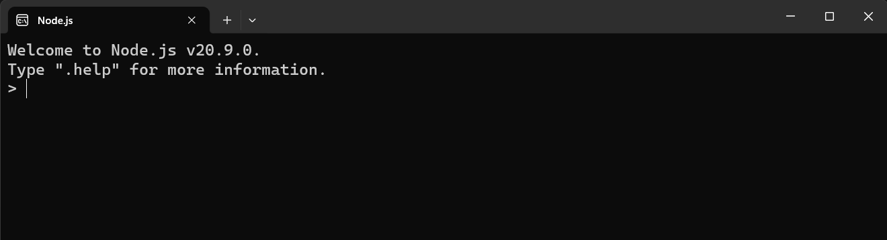
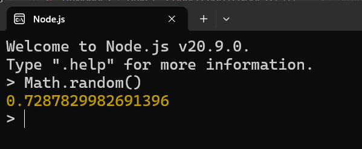

# Usando o Node Diretamente

Sabia que é possível executar código JavaScript diretamente no programa do Node, sem criar arquivos?

Isso pode ser muito útil para realizar operações rápidas com o JavaScript, como a geração de um número aleatório ou até mesmo executar pacotes do Node (você aprenderá mais sobre eles ao longo do curso).

Vamos testar? Existem duas formas de abrir o programa do Node:

1. Pesquise por “Node.js” no seu computador e selecione a seguinte correspondência:

Recorte de tela mostrando o resultado da pesquisa. Nele está o nome “Node.js”, abaixo dele está informando que é um aplicativo, e ao lado está o logo do Node.js.

2. Ou, no terminal do seu computador, apenas execute o comando `node`.

Em seguida, um programa de linha de comando será executado, muito semelhante ao terminal:

Captura de tela do programa do Node. É uma tela preta com letras brancas. No início, está escrito em inglês: “Boas vindas ao Node.js v20.9.0. Pressione ‘.help’ para mais informações”. Logo abaixo, há um espaço para digitação.

E nele podemos executar operações válidas do JavaScript, como criação de variáveis, `console.log`, entre outras. Na imagem abaixo, temos a geração de um número aleatório com a função nativa `Math.random()`:

Foi executado o comando “Math.random()” e o Node.js retornou o valor “0.7287829982691396”.

Esse programa é muito semelhante aos consoles dos navegadores, mas como você deve imaginar, podemos executar não apenas funções como `Math.random()`, mas também pacotes do Node e operações locais.

### [Voltar ao Menu - Node.js e terminal: dominando o ambiente de desenvolvimento front-end](../menu.md)